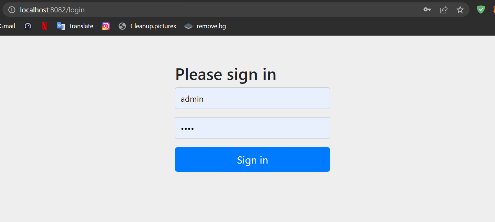

# Gestion des patients
Application web JEE Gestion des patients

### Page Login

* Cette page nous permet de s'authentifier pour accéder à l'interface principale du gestion des patients
* On peut se connecter par le Role "Admin" ou "USER"

### Page d'Accueil 

* La page d'Accueil représente Le Menu Nav Bar et le logo, et on peut aussi voir à droite l'utilisateur connecter, si on clique sur l'utilisateur connecter le dropdown va afficher Logout pour se déconnecter.

### Nouveau Patient

* Après de cliquer sur le menu Patients dans le Nav-bar on peut ajouter un Nouveau Patient, il faut saisir tous les champs
* Les Roles ADMIN et USER on le droit tous les deux de voir cette ressource

### Rechercher Patient

* Après de cliquer sur rechercher sur le drop down "Patients", On peut voir la liste des patients, on peut effectuer une recherche multicritère par le nom, prenom ou le score
* L'Admin peut Supprimer des patients ou les modifiers

### Modifier Patient

* Après de cliquer sur Edit, On peut modifier un patient existant
* Seulement l'ID qui ne peut pas être modifier

### Supprimer Patient

* Après de cliquer sur Delete on peut supprimer un patient
* Un message de confirmation va apparaître

